# 基于Java+SpringBoot+Vue彩票销售系统(源码+数据库)

### 作者QQ：3275035005 微信：xkbishe123 (支持修改、 部署调试、 代做接毕业设计和课程设计)

### 网站建设、小程序、H5、APP、各种系统、样式修改、10000套源码可选。

### 选题+开题报告+任务书+程序定制+安装调试+论文+答辩ppt 都可以做

### 问题包修改，包满意，有需求尽管甩过来！一条龙帮你安心过！

### 所有项目以及源代码本人均调试运行无问题 可支持远程调试运行

# 项目介绍
基于SpringBoot彩票销售系统-毕业设计，本系统分前台端和管理端两部分，项目采用前后端分离开发

### 1. 用户

- 用户登录注册
- 密码修改
- 首页查看公告
- 首页分类查询
- 彩票搜索查询
- 彩票下注
- 查看我的订单
- 个人中心修改
- 余额充值
- 奖金计算器
- 退出登录

### 3. 系统管理员

- 管理员登录
- 密码修改
- 系统首页公告
- 系统首页销量分析
- 用户信息管理
- 公告信息管理
- 轮播图信息管理
- 订单信息管理
- 商品信息管理
- 商品类别管理
- 彩票开奖
- 个人信息修改
- 密码修改
- 退出登录

# 技术框架
- 开发语言：Java8
- 数据库：Mysql5.7以上
- 系统环境：jdk8、maven、node
- 后端框架：SpringBoot、MyBatisplus、MyBatis
- 前端框架：Vue、Elementui
- 工具：IDEA、Navicat
- 技术架构：前后端分离、B/S架构、MVC架构
# 项目截图

### 1. 管理端

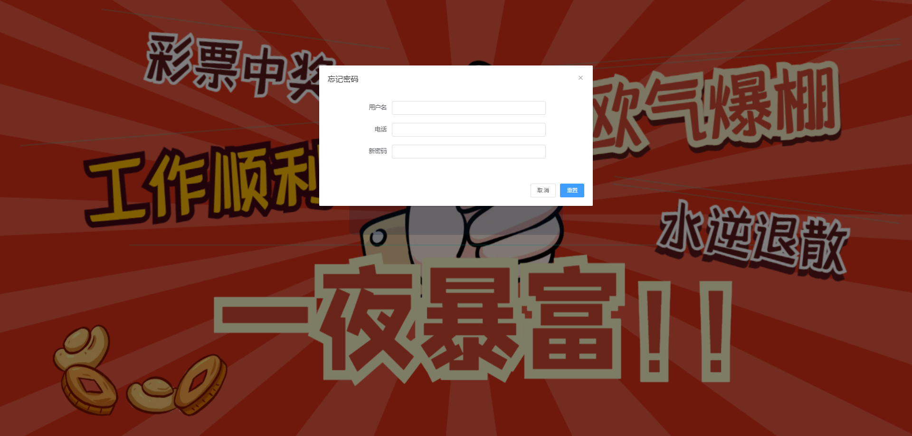

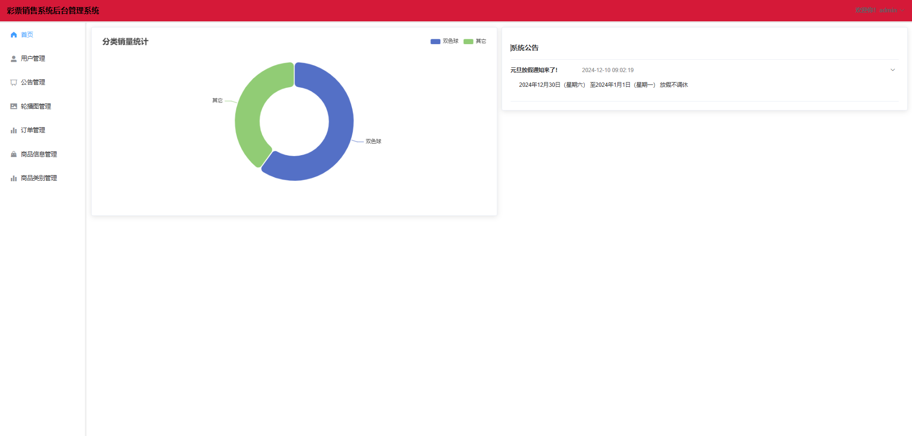

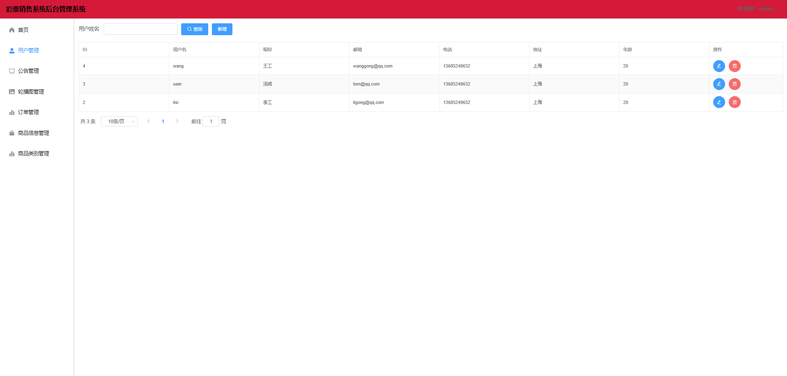

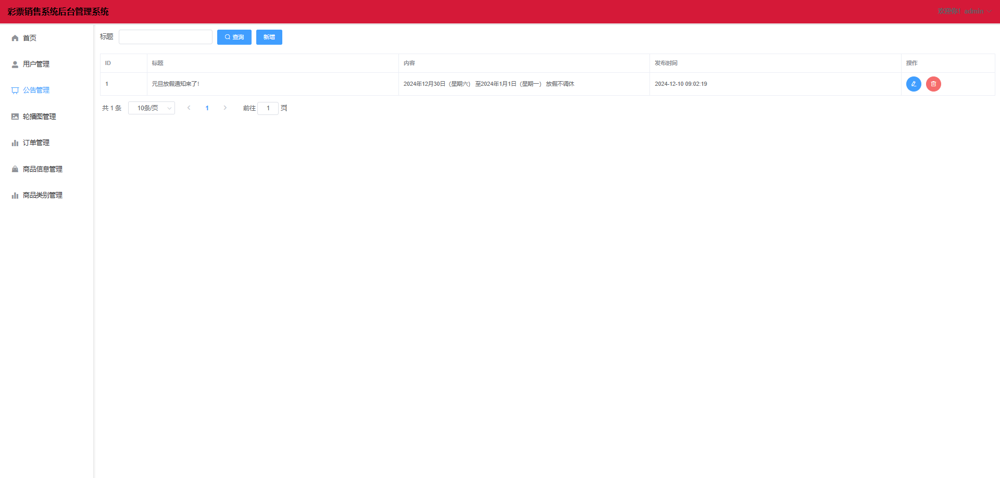

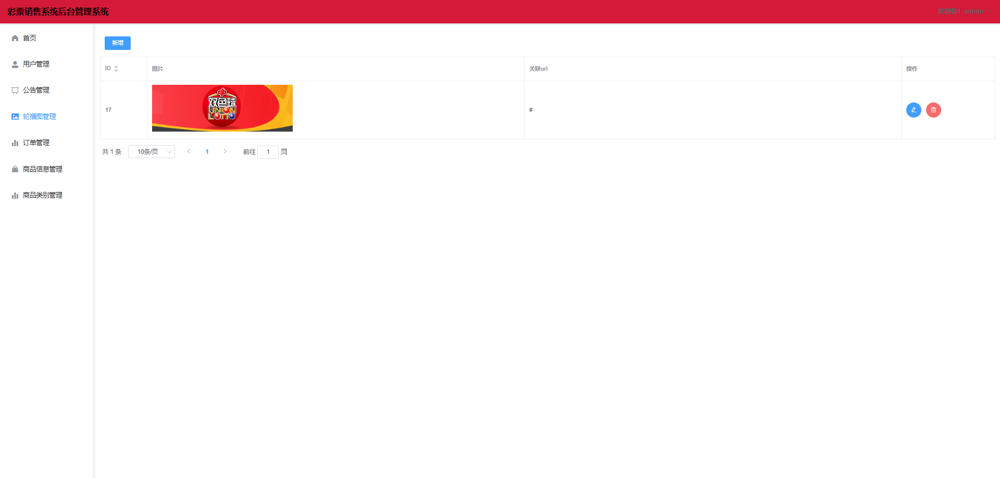

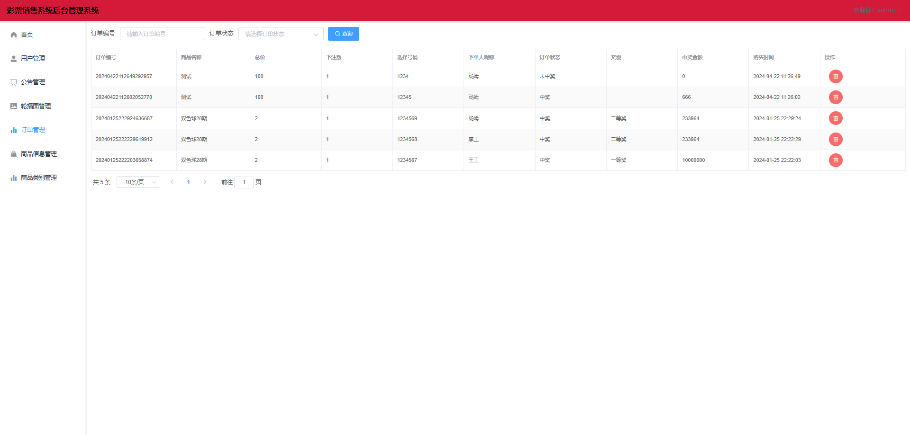

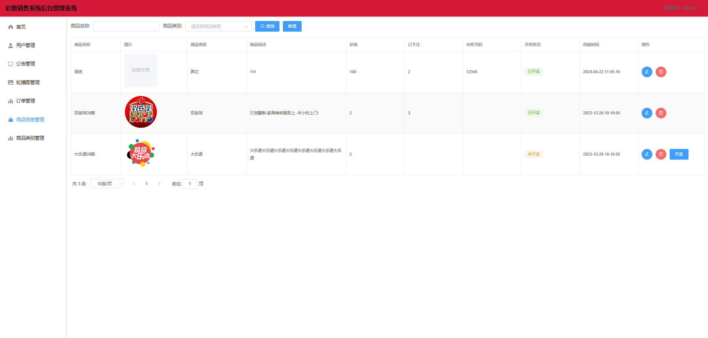

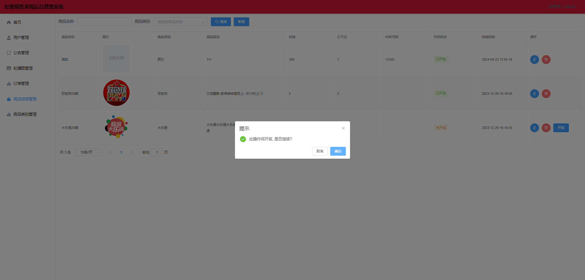

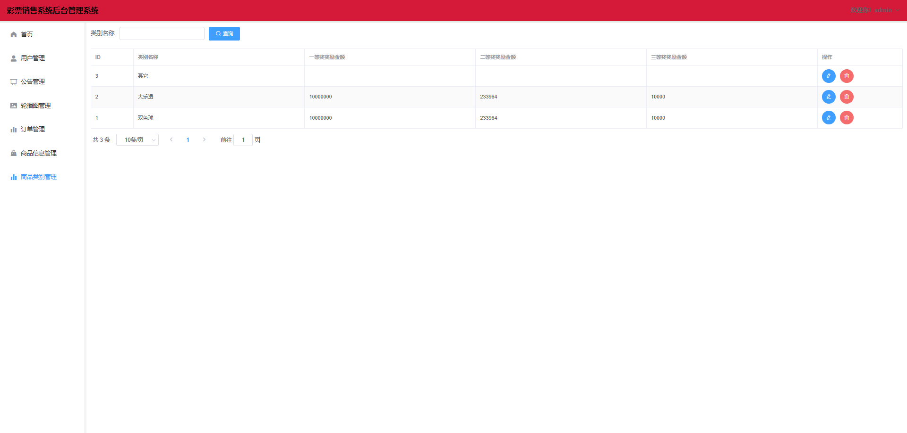

### 2. 用户端

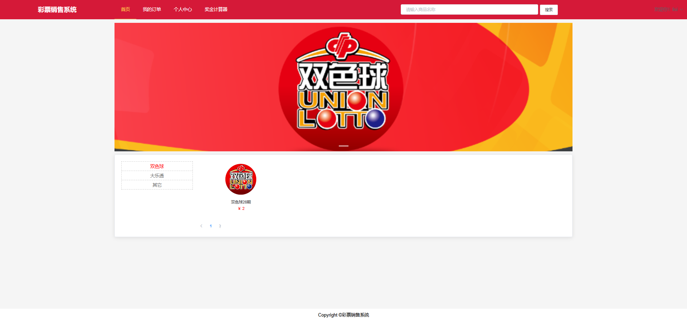

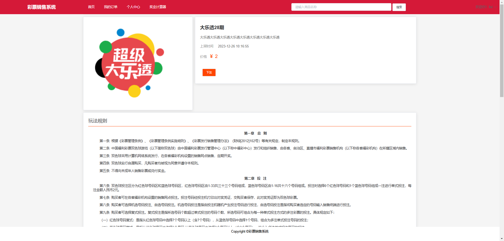

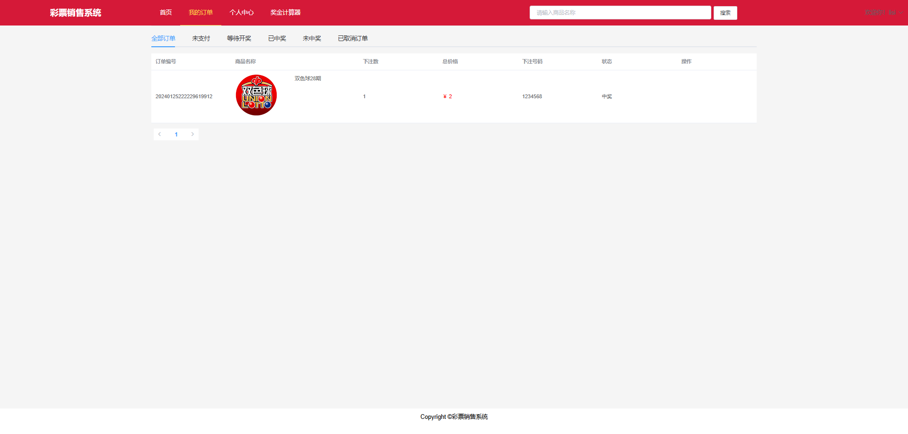

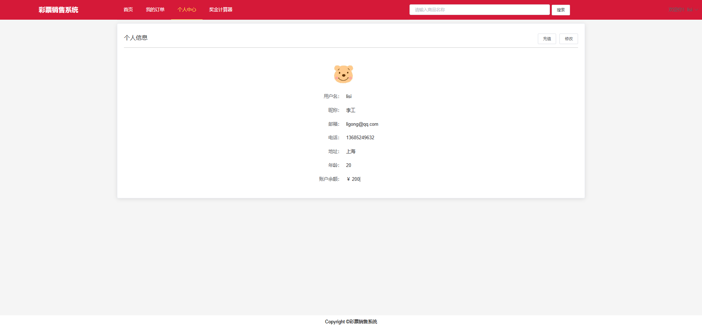

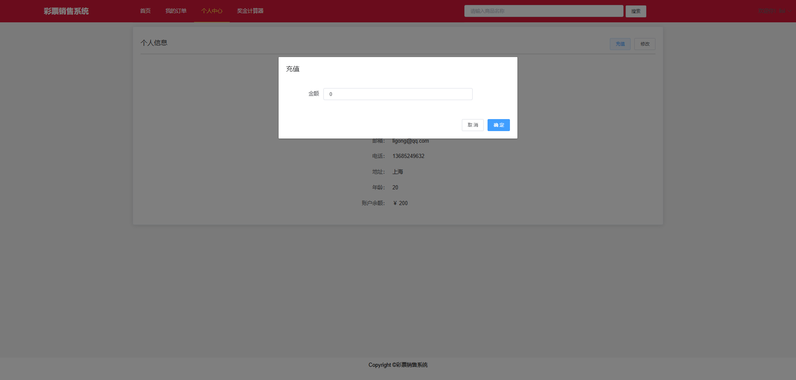

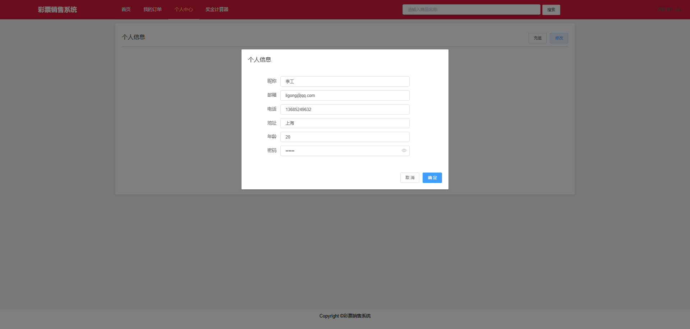

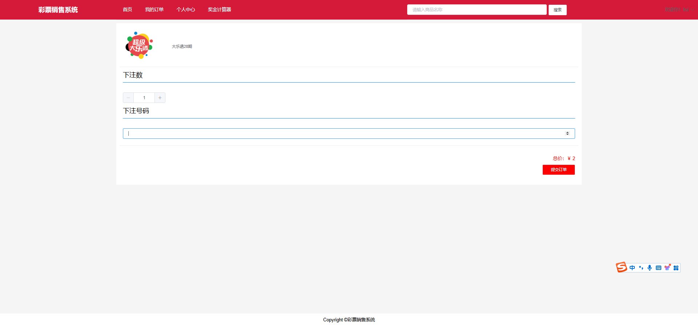

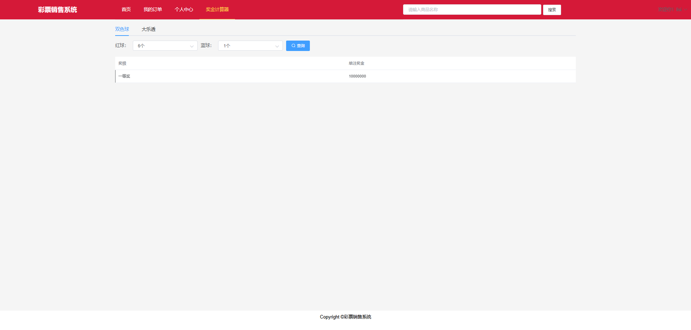
